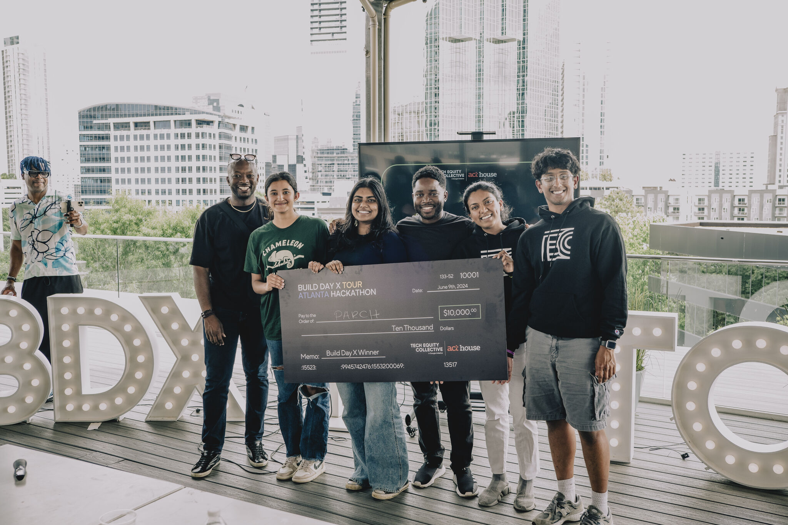
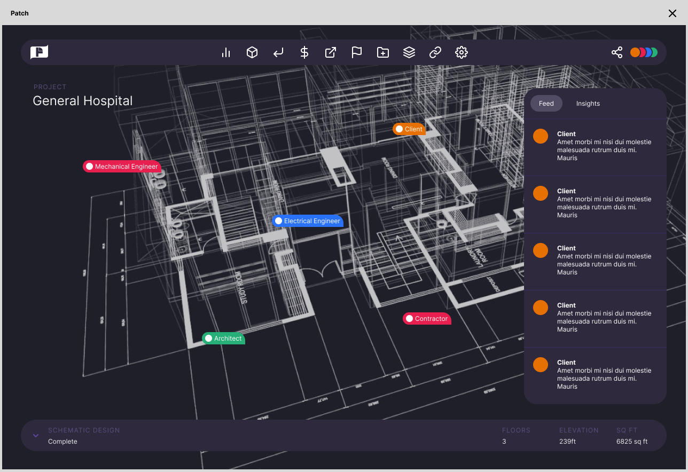

## Atlanta Build Day Hackathon (1st 🏆)

* Designed and acted as lead engineer for structural design collaboration for architects and structural engineers tool that won the ACT House Build Day Hackathon, securing $10,000 in prize pre-seed money
* Implemented AI features within platform including document parser and AI assistant using RAG and OpenAI’s GPT-neo

Take a look at our [pitch](https://www.canva.com/design/DAGHpVXSlIM/8pIgLinkMVZUu3mw-gAskQ/view?utm_content=DAGHpVXSlIM&utm_campaign=designshare&utm_medium=link&utm_source=editor) and our current progress on my [github!](https://github.com/rahilisashaik/parch)

  <figure style="display: inline-block; margin-right: 10px; text-align: center; width: 350px;">
    
    <figcaption style="font-size: 14px; color: #666;">The Parch team with our $10,000 prize </figcaption>
  </figure>
  <figure style="display: inline-block; text-align: center; width: 350px;">
    
    <figcaption style="font-size: 14px; color: #666;">Demo application</figcaption>
  </figure>

## BlackRock Product Development Life Cycle Competition (3rd 🏆)

* Developed and acted as lead engineer for browser-extension based AI tool that augments and standardizes documentation to make it more readable that placed third in BlackRock’s PDLC competition
* Deployed chrome extension using ReactJS and built model using Latent Dirichlet Allocation, Llama, and vector databases