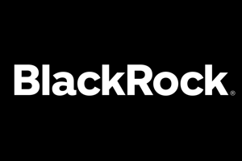
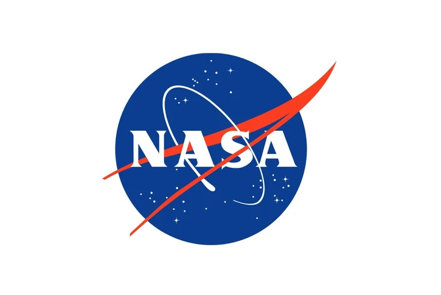



## Education 
### University of California, Berkeley, 2025
* _BS Electrical Engineering & Computer Science_ 
* _BS Chemical Engineering_

## Work experience

<figure style="display: inline-block; margin-right: 10px; text-align: center; width: 350px;">
  
  <figcaption style="font-size: 14px; color: #666;">BlackRock - Summer 2024, SWE Intern</figcaption>
</figure>
<figure style="display: inline-block; text-align: center; width: 350px;">
  
  <figcaption style="font-size: 14px; color: #666;">Panasonic - Summer 2023, SWE Intern</figcaption>
</figure>
<figure style="display: inline-block; margin-right: 10px; text-align: center; width: 350px;">
  
  <figcaption style="font-size: 14px; color: #666;">Texas Instruments - 2023-24, Contract MLE Intern</figcaption>
</figure>
<figure style="display: inline-block; text-align: center; width: 350px;">
  
  <figcaption style="font-size: 14px; color: #666;">NASA - Summer 2022, Software Automation Intern</figcaption>
</figure>

## Skills
* **Languages**: Java, Python, C/C++, Typescript
* **Frameworks**: JUnit, Spring, ReactJS, Django, ROS2, REST API, Mockito
* **Developer Tools**: Git, Azure DevOps, NoSQL, AWS, Google Cloud, SQL
* **Libraries**: pandas, NumPy
  
## Leadership
* **Voyager Consulting** - Internal Vice President
* **Cal Lacrosse** - Goalie

[Resume](../images/Resume.png "My actual resume if you would like to see more of my past experiences and qualifications")
