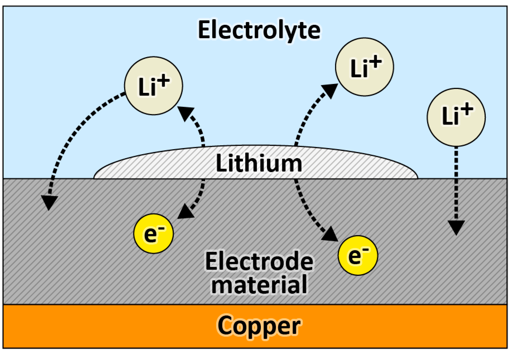
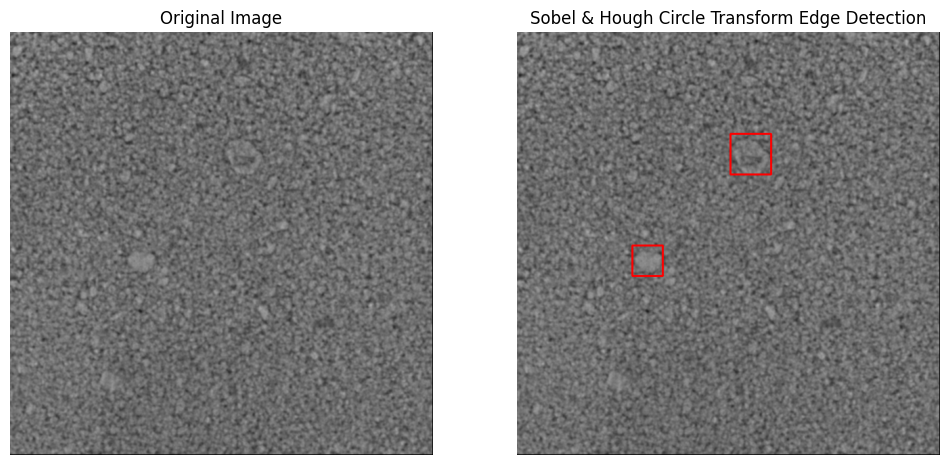


  
You can also find my articles on <a href="{{site.author.googlescholar}}">my Google Scholar profile</a>.






  


## Using Computer Vision to Predict Graphite Anode Combustion in Lithium Ion Batteries

To understand my research, you need a basic understanding of battery transport processes. Within a battery, there is an anode, electrolyte, and cathode. Essentially, lithium ions diffuse from the anode to the cathode via the electrolyte in a system that looks like this: anode ➡️ electrolyte ➡️ cathode. As the lithium ions move, electrons flow through an external circuit from the anode to the cathode, which generates an electric current.

Sometimes, this system combusts, and it is often due to lithiation, which happens in lithium-ion batteries over time or due to poor charging practices. This is when the lithium ions build up on the electrode until they eventually touch the anode, which causes combustion. 

  <figure style="display: inline-block; text-align: center; width: 350px;">
    
    <figcaption style="font-size: 14px; color: #666;">Lithiation Visual</figcaption>
  </figure>

Lithiation is a result of uneven charge diffusion into the battery anode. This results in some particles growing quicker than others. This research seeks to utilize real-time images of battery anodes and track this particle growth to predict uneven charge points to reduce lithiation and mitigate battery combustion.

  <figure style="display: inline-block; text-align: center; width: 1000;">
    
    <figcaption style="font-size: 14px; color: #666;">Anode particle growth detection </figcaption>
  </figure>

